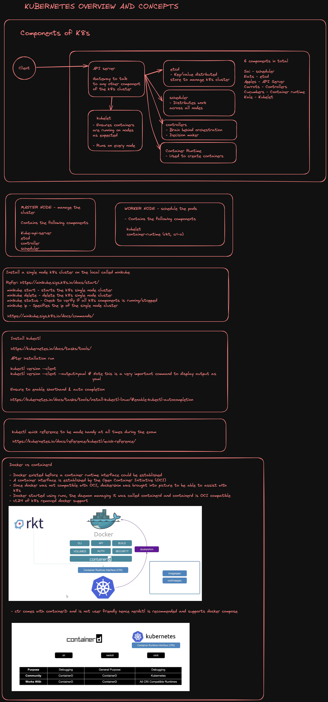
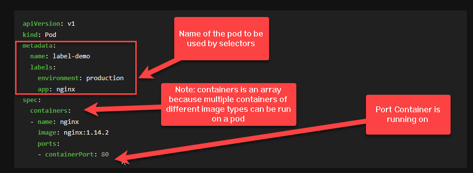
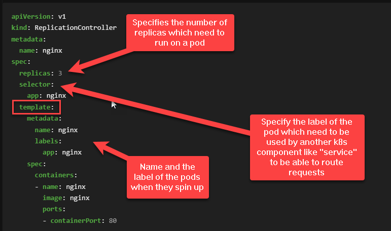
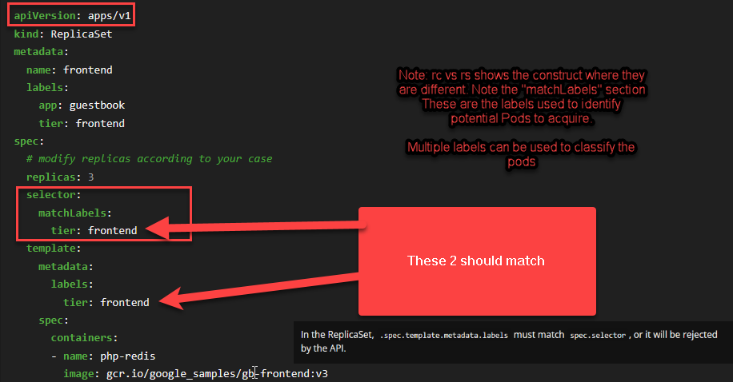
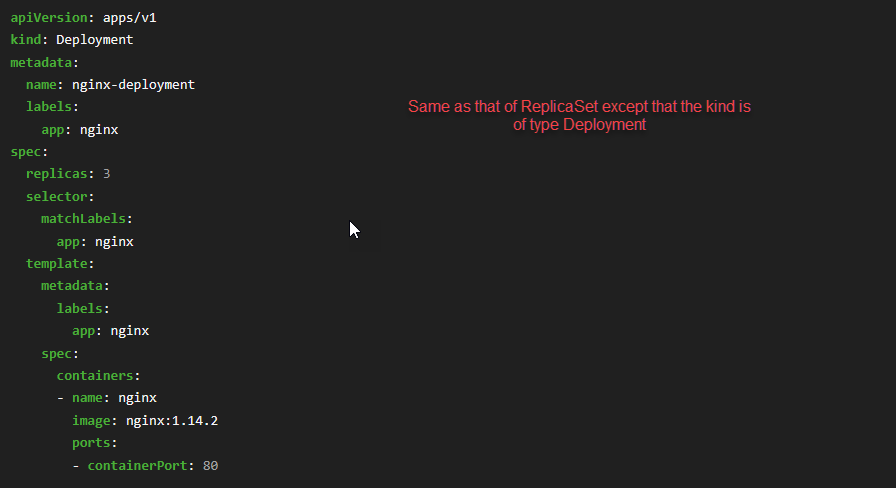
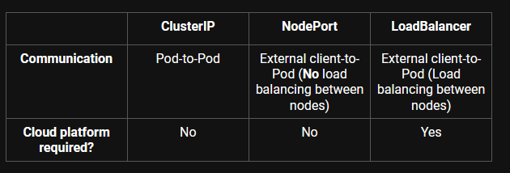

# Basics

<!-- TOC -->
* [Basics](#basics)
  * [Pre-requisites](#pre-requisites)
  * [Kubernetes Overview](#kubernetes-overview)
  * [K8s concepts](#k8s-concepts)
    * [Pods](#pods)
      * [Commands](#commands)
    * [Replication Controllers and Replica Sets](#replication-controllers-and-replica-sets)
      * [Commands](#commands-1)
    * [Deployments](#deployments)
      * [Commands](#commands-2)
    * [Recommended reading](#recommended-reading)
    * [Services](#services)
      * [Types of Services](#types-of-services)
        * [ClusterIP](#clusterip-)
        * [NodePort](#nodeport)
        * [LoadBalancer –](#loadbalancer--)
        * [Summary](#summary)
* [API Versions](#api-versions)
* 
<!-- TOC -->
## Pre-requisites
* vi-cheatsheet: https://www.atmos.albany.edu/daes/atmclasses/atm350/vi_cheat_sheet.pdf
* Only k8s docs are permitted: https://kubernetes.io/docs/home/
* Markdown cheatsheet: https://github.com/adam-p/markdown-here/wiki/Markdown-Cheatsheet
* CKAD Practice per topic: https://github.com/dgkanatsios/CKAD-exercises/blob/main/a.core_concepts.md
* Arun's CKAD Book: https://github.com/aganesan94/ckad
* Install minikube and kubectl
* Set up kubectl  as alias using the quick reference https://kubernetes.io/docs/reference/kubectl/quick-reference/
---

## Kubernetes Overview



## K8s concepts

*Note: Always remember to make sure which namespace you are working on*

### Pods

* Short hand is "po"
* Smallest object your can create in K8
* Contains one or more containers. Containers cannot be of the same type cannot be run on a pod
* Runs on a Worker Node
* Pods have a one to one relationship with containers
* Pods are transient, they do not store any information persistently unless we specify persistent volumes
* Single pod can have multiple containers which are not of the same type



#### Commands
```
# Imperative command to run a pod
kubectl run <pod-name> --image <image-name:version>

# Imperative command to run a pod with a --watch
kubectl run <pod-name> --image <image-name:version> --watch

# Imperative commadn to do a quick dry run to check the pod specification
# This can be piped to a file
kubectl run nginx --image=nginx --dry-run=client 

# Getting a list of pods across all namespaces
kubectl get pods --all-namespaces 

# Counting a list of pods across all namespaces
# NOTE: The output is one less than the count provided
kubectl get pods --all-namespaces  | wc -l

# Getting a pods yaml file
kubectl get pod my-pod -o yaml 
 
# Be thorough with all the semantics of pods from this output at all times
# This provide more information of which worker node the pod is deployed or scheduled in
kubectl get pods -o wide

# delete a pod which was created from a defintion file
kubectl delete pod -f <pod-definition.yml>

# Delete a pod
kubectl delete pod <pod-name> -n <namespace>

#Force Delete the pod
kubectl delete pod <pod-name> -n <namespace> --force

# Finding the image used to create a  pod
# Note: Word image is in Caps
kubectl describe pod <pod-name> | grep "Image"

# Getting the total number of containers in a pod
kubectl describe pod <pod-name> | grep "Container ID"

# Get the status of the pod
# Look at the last line after describing the pod or look at status
kubectl get pod

# To see why a container is not running, look at the "Events" section
kubectl describe pod <pod-name>

# To get all pods
# To fetch the "no of containers running/total containers"  running
# in the pod look at the "status" column using the following command
kubectl get pods 

# Edit a pod, Change some parameters, Write to a file
kubectl edit pod <pod-name>

# Gets the pod definition as a yaml file
kubectl get pod <pod-name> -o yaml

# Describing all pods
kubectl get pods

# Create vs apply command
# Note this applies to not just pods but to any object
# Imperative Management vs Declarative Management
# Imperative management means giving a series of instructions or steps to reach the goal. We specify what and how we should reach the goal.
# This is where we tell K8S what to create, replace, delete, etc., using the API. Objects are created and managed using the kubectl command on the command line interface (CLI).
# Declarative management is where we specify the required outcome, not the individual steps needed to achieve that outcome.
# For each kind of resource specified in our YAML configuration files, a dedicated controller checks what we currently have and tries to converge it with what we want.
# create is imperative, if the resource already exists, this command will error.
# apply is declarative, If the resource already exists, this command will not error.
kubectl create -f <file-name-definition> - Imperative command
kubectl apply (-f FILENAME | -k DIRECTORY)
```

### Replication Controllers and Replica Sets

* Short hand is "rs"
* When pods die, they don't come back up automatically
* Replication Controllers ensure that pods can be up and running if pods
   get deleted.
* They allow for load sharing within pods across multiple nodes in k8s
  cluster
* ReplicaSets are the new way to avoid the use cases as opposed to
  Replication Controller






* Check if you are in right namespace
* Check for the following
  * label match between template and selector
  * apiVersion is correct at all times as per the spec
  * kind is correctly defined
* Whenever a replica set is edited, delete the pods so it picks up
   the new definition.
* Check if it has the right image

#### Commands
```shell
# Create a replicaset
kubectl create -f <rs-file>.yml

# Replace a replica set
kubectl replace -f <rs-file>.yml

# Imperative command to scale replicas from a file
kubectl scale --replicas=<no> -f <file-name>.yml

# Imperative command to scale an existing running replica
# Note the object name is specified as "replicaset"
kubectl scale --replicas=<no> replicaset <replica-name>

# Finding the number of desired and replicasets
kubectl get replicasets

# Finding the number of replicaset
# Note this will provide a count, count less than 1
# Alternate is to use the get rs to find out and count it manually
kubectl get rs | wc -l

## Edit the replicaset directly
# delete the pods to reflect the state of the
# edited replicaset
kubectl edit rs <rs-name>
k delete po $(k get po  | grep <rs-name> | awk '{print $1}')
```

### Deployments

A deployment is a higher-level object that provides advanced features such as rolling updates, 
rollbacks, and self-healing capabilities, while a replicaset is a lower-level object that is 
responsible for ensuring that a specified number of replicas are always running.

* Rolling Updates: Rolling updates ensure that an application is updated gradually, one replica at a time, while ensuring that the overall availability of the application is not impacted. In comparison, ReplicaSets only support scaling and managing replicas.
* Rollback: Deployments automatically rollback to a previous version of an application if an update fails. For ReplicaSets, this process would need to be manually performed.
* Version Control: Similar to the previous feature, Deployments implement version control, hence allowing for the ability to rollback to a previous specific version.

* Check if you are in right namespace
* Check for the following
    * label match between template and selector
    * apiVersion is correct at all times as per the spec
    * kind is correctly defined
* Whenever a replica set is edited, delete the pods so it picks up
  the new definition.
* Check if it has the right image



#### Commands

```shell
# Show all the objects created in the cluster
kubectl get all

# If you need to know all the events occuring the cluster
# typically done to troubleshoot then this will provide you
# all information
kubectl get events
kubectl get ev

# Record the deployment so it can register history
kubectl create -f <deployment-file> --record 

# Create a deployment with a specific nginx version
# Every rollout of a deployment creates a revision
# Check out the  status of the deployment "status"
# Check out the revision status by using the "history"
# Update the version of nginx 
# Perform another deployment (by editing a file or using kubectl apply)
# Check the rollout history
# There are 2 deployment strategies
# Recreate - describing the deployment shows the scale down to 0
# RollingUpdate - describing the deployment shows the pods rolling one by one.
kubectl rollout status  deployment <deploymentname>
kubectl rollout history deployment <deploymentname>

# Undo and rollback to previous 
kubectl rollout undo deployment <deploymentname>

# Imperative command to update the image in the deployment
kubectl set image deployment/<deployment-name> <container-name>=<image:version>
```

### Recommended reading

* Difference between the different controllers is an essential read
https://semaphoreci.com/blog/replicaset-statefulset-daemonset-deployments

### Services

What does ClusterIP, NodePort, and LoadBalancer mean?
The type property in the Service's spec determines how the service is exposed to the network. The possibles are ClusterIP, NodePort, and LoadBalancer

* In kubernetes a service always enables its network access to a pod or set of pods
* Services will select the pods based on their labels and when a network is made to those services it selects all Pods in the cluster matching the service’s selector and will choose one of them, and then will forwards the network request to it.
* A deployment is responsible for keeping a set of pods running in a cluster. A service is responsible for enabling network access to a set of pods in a cluster


#### Types of Services

##### ClusterIP 
* The default value. The service is only accessible from within the Kubernetes cluster
* In Kubernetes, the ClusterIP Service is used for Pod-to-Pod communication within the same cluster. 
* This means that a client running outside of the cluster, such as a user accessing an application over the internet, cannot directly access a ClusterIP Service.
* When a ClusterIP Service is created, it is assigned a static IP address. This address remains the same for the lifetime of the Service. When a client sends a request to the IP address, the request is automatically routed to one of the Pods behind the Service. 
* If multiple Pods are associated, the ClusterIP Service uses load balancing to distribute traffic equally among them. 

##### NodePort
* This makes the service accessible on a static port on each Node in the cluster.
* The NodePort Service is a way to expose your application to external clients. 
* An external client is anyone who is trying to access your application from outside of the Kubernetes cluster.
* The NodePort Service does this by opening the port you choose (in the range of 30000 to 32767) on all worker nodes in the cluster. This port is what external clients will use to connect to your app.
* NodePort Service builds on top of the ClusterIP Service type. 
* What this means is that when you create a NodePort Service, Kubernetes automatically creates a ClusterIP Service for it as well. The node receives the request, the NodePort Service picks it up, it sends it to the ClusterIP Service, and this, in turn, sends it to one of the Pods behind it (External Client->Node->NodePort->ClusterIP->Pod). And the extra benefits are that internal clients can still access those Pods, and quicker. 
* They can just skip going through the NodePort and reach the ClusterIP directly to connect to one of the Pods.

##### LoadBalancer – 
* The service becomes accessible externally through a cloud provider's load balancer functionality. GCP, AWS, Azure, and OpenStack offer this functionality.

##### Summary




# API Versions

Note: Make sure to pay attention to the versions to ensure the pods are up and running
and are working.

| Kind/Type| Versions |
|----------|------:|
| Pod | v1 |
| Service | v1 |
| PersistentVolume | v1 |
| PersistentVolumeClaim | v1 |
| Job | batch/v1 |
| CronJob | batch/v1beta1 |
| ConfigMap | v1 |
| Secret | v1 |
| ServiceAccount | v1 |
| Namespace | v1 |
| ReplicationController | v1 |
| ReplicaSet | apps/v1 |
| Deployment | apps/v1 |
| StatefulSet | apps/v1 |
| StorageClass | storage.k8s.io/v1 |
| NetworkPolicy | networking.k8s.io/v1 |


