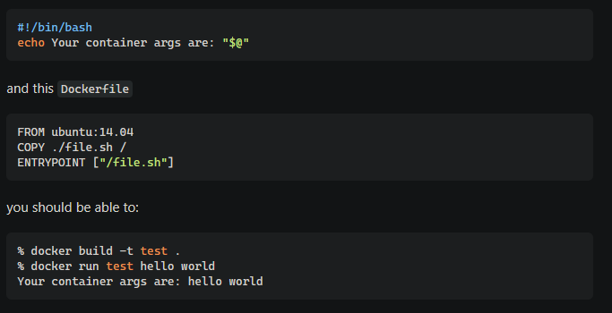
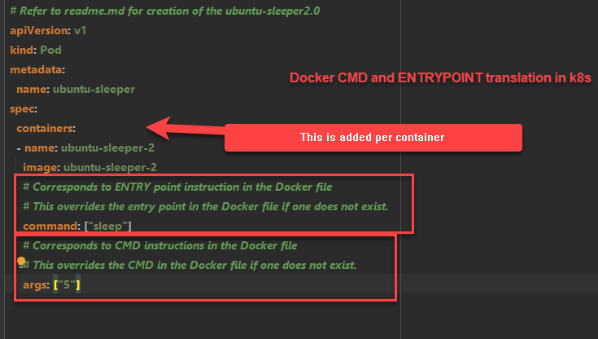
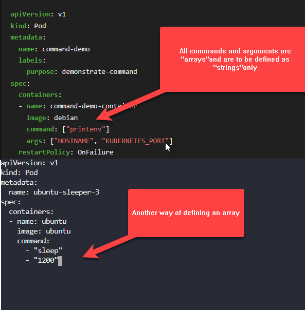

# Commands and Arguments


## Docker CMD Vs ENTRYPOINT
```shell
# The below command just runs and exits. 
# This is because if you take a look at the Dockerfile for this particular use case 
# it does not have any instructions to keep the command running.
docker run ubuntu

#Running the below command keeps the container running for 5 seconds before it terminates.
docker run ubuntu sleep 5

# To keep this running permanently, create a Dockerfile with the following sequence
# The CMD command can be specified in the following ways
# CMD["unix-command-to-execute","arguments-to-the-unix-command"]
# Use the docker file create an image called "ubuntu-sleeper"
# CMD ["sleep","5"]
# CMD sleep 5
FROM UBUNTU
CMD sleep 5

# When the docker file is built use the following to override the cmd
docker run ubuntu-sleeper sleep 10

# Making it more legible by converting CMD into an entry point which can take an argument
# and then running the docker run command
FROM UBUNTU
ENTRYPOINT ["sleep"]
docker run ubuntu-sleeper 10
#Overriding the entrypoint
docker run --entrypoint "<some-alternative-tos-sleep>" ubuntu-sleeper 10
# Same command as above to start the container with the sleep command
docker run --name ubuntu-sleeper-container --entrypoint "<some-alternative-tos-sleep>" ubuntu-sleeper 10


# One more way to override the argument
FROM UBUNTU
ENTRYPOINT ["sleep"]
CMD 5

# Keep docker container running for debuggin
ENTRYPOINT ["tail"]
CMD ["-f","/dev/null"]

# Passing an environment variable using the run command
docker run -e APP_COLOR=pink simple-webapp-color

```

### Legible way of passing arguments


## K8s CMD vs ENTRYPOINT



### Sample-1: Running a command and an argument

```shell
k apply -f samples/sample-1/pod.yml
k logs -f sample-command-args-pod-demo
```
## Defining commands


### Sample-2: Running a pod indefinitely

```shell
k apply -f samples/sample-2/pod.yml
k logs -f sample-2-pod-container-running
```
