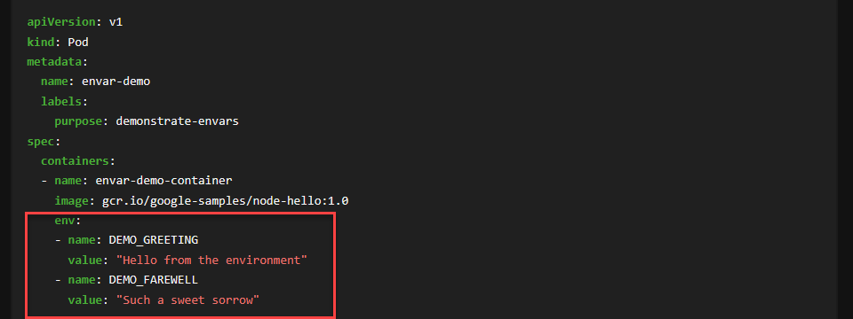
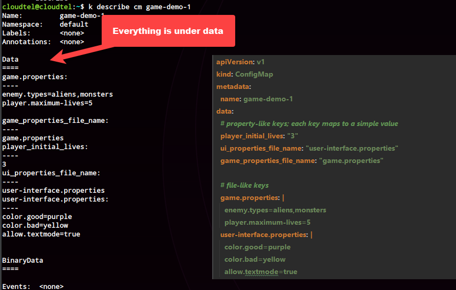

# Environment, Configmaps and Secrets

## Environment Variables

### Setting via Docker
```shell
# Set environment variables via docker
docker run -e key=val <image-name>
```
### Setting via K8s

---

## Config Maps

* Allows for environment variable reuse
*  2 stages
  * Stage 1: Create a configmap
  * Stage 2: Use a file

### via CLI using a literal
```
kubectl create configmap <config-map-name> \
 --from-literal=<key>=<value> \
 --from-literal=<key>=<value> 
```
### Via CLI using a file 
```
kubectl create configmap <config-map-name> \
 --from-file=<path-to-properties-file>
```

### Via Declaration

* Save the below snippet into a file
* Run the following via 

#### Sample 1 : With a Volume Mount


##### Commands
```shell

kubectl create -f samples/configmaps/sample-2/cm.yml
kubectl get cm game-demo
kubectl describe cm game-demo
```
#####  Translation of cm definition to a cm object.


##### How to use it in the pod?

###### Mounting all the properties in the config map
```shell

# Create the 2 pods
kubectl create -f samples/configmaps/sample-2/pod.yml

# Analysis
kubectl get po configmap-demo-pod


# Shell into the pod
k exec -it configmap-demo-pod-1 /bin/sh

# ls /config
game.properties            game_properties_file_name  player_initial_lives       ui_properties_file_name    user-interface.properties

# ls -ltr /config
lrwxrwxrwx    1 root     root            32 Jan 25 13:34 user-interface.properties -> ..data/user-interface.properties
lrwxrwxrwx    1 root     root            30 Jan 25 13:34 ui_properties_file_name -> ..data/ui_properties_file_name
lrwxrwxrwx    1 root     root            27 Jan 25 13:34 player_initial_lives -> ..data/player_initial_lives
lrwxrwxrwx    1 root     root            32 Jan 25 13:34 game_properties_file_name -> ..data/game_properties_file_name
lrwxrwxrwx    1 root     root            22 Jan 25 13:34 game.properties -> ..data/game.properties

```

```shell
k exec -it configmap-demo-pod-2 /bin/sh

# cat the following files to view the key value pairs
# which are mounted via a volume mount
# config maps in this case are available via a volume mount
# and how they are mounted
ls /config/
cat /config/game.properties
cat /config/user-interface.properties
ls /config/..data/

# The application can now read these files and load
# the environment variables 
# Note: this is being grepped based on the name of the environment variable in the pod
env | grep PLAYER_INITIAL_LIVES
PLAYER_INITIAL_LIVES=3

# In case of this property, the key and value are defined but value contains the file name
# as opposed to the contents of the file.
# Note: this is being grepped based on the name of the environment variable in the pod
env | grep UI_PROPERTIES

ls /config/
game.properties            user-interface.properties
```

#### Sample 2 : With a Volume Mount