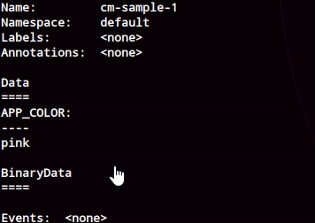
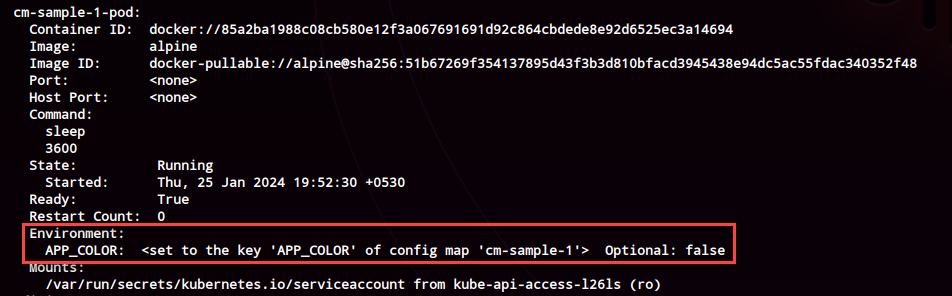
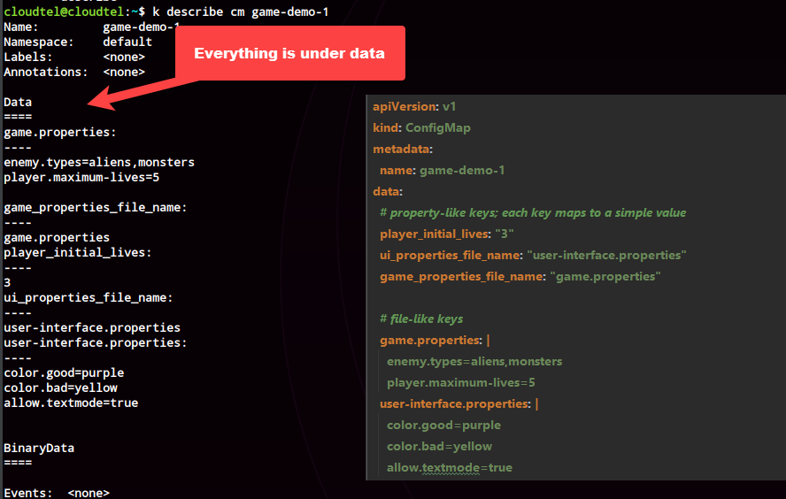

# Config Maps

<!-- TOC -->
* [Config Maps](#config-maps)
    * [via CLI using a literal](#via-cli-using-a-literal)
    * [Via CLI using a file](#via-cli-using-a-file-)
    * [Sample 1:  Basic Config Map](#sample-1-basic-config-map)
      * [Translation of cm definition to a cm object.](#translation-of-cm-definition-to-a-cm-object)
    * [Sample 2 : Create a config map and inherit just one key as a value as an environment variable](#sample-2--create-a-config-map-and-inherit-just-one-key-as-a-value-as-an-environment-variable)
    * [Sample 3 : Create a config map and inherit all the values](#sample-3--create-a-config-map-and-inherit-all-the-values)
    * [Sample 4 : With a Volume Mount - Importing all Variables](#sample-4--with-a-volume-mount---importing-all-variables)
      * [Translation of cm definition to a cm object.](#translation-of-cm-definition-to-a-cm-object-1)
    * [Sample 5 : With a Volume Mount - Importing only required variables, mount](#sample-5--with-a-volume-mount---importing-only-required-variables-mount-)
<!-- TOC -->
* Allows for environment variable reuse

## via CLI using a literal
```shell
kubectl create configmap <config-map-name> \
 --from-literal=<key>=<value> \
 --from-literal=<key>=<value>
 
kubectl create configmap create-configmap-by-literal \
 --from-literal=name=kartees \
 --from-literal=age=23  
```
## Via CLI using a file 
```shell
kubectl create configmap <config-map-name> \
 --from-file=<path-to-properties-file>
 
 kubectl create configmap create-configmap-from-file  --from-file=$(pwd)/samples/configmaps/sample-6/user.properties
```

## Sample 1:  Basic Config Map

```shell
# Create the config map
k apply -f samples/configmaps/sample-1/cm.yml
k get cm cm-sample-1
k describe cm cm-sample-1
```
###  Translation of cm definition to a cm object.




## Sample 2 : Create a config map and inherit just one key as a value as an environment variable

```shell
k apply -f samples/configmaps/sample-2/cm.yml
k get cm cm-sample-2
k describe cm cm-sample-2
k describe po cm-sample-2-pod
```

## Sample 3 : Create a config map and inherit all the values

```shell
k apply -f samples/configmaps/sample-3/cm.yml
k get cm cm-sample-3
k describe cm cm-sample-3
k describe po cm-sample-3-pod
```

## Sample 4 : With a Volume Mount - Importing all Variables

###  Translation of cm definition to a cm object.


```shell

k apply -f samples/configmaps/sample-4/cm.yml
k get cm cm-sample-4
k describe cm cm-sample-4
k get po cm-sample-4-pod


# Shell into the pod
k exec -it cm-sample-4-pod /bin/sh

# ls /config
game.properties            game_properties_file_name  player_initial_lives       ui_properties_file_name    user-interface.properties

# ls -ltr /config
lrwxrwxrwx    1 root     root            32 Jan 25 13:34 user-interface.properties -> ..data/user-interface.properties
lrwxrwxrwx    1 root     root            30 Jan 25 13:34 ui_properties_file_name -> ..data/ui_properties_file_name
lrwxrwxrwx    1 root     root            27 Jan 25 13:34 player_initial_lives -> ..data/player_initial_lives
lrwxrwxrwx    1 root     root            32 Jan 25 13:34 game_properties_file_name -> ..data/game_properties_file_name
lrwxrwxrwx    1 root     root            22 Jan 25 13:34 game.properties -> ..data/game.properties
```

## Sample 5 : With a Volume Mount - Importing only required variables, mount 

```shell

k apply -f samples/configmaps/sample-5/cm.yml
k get cm cm-sample-5
k describe cm cm-sample-5

k exec -it cm-sample-5-pod /bin/sh

# cat the following files to view the key value pairs
# which are mounted via a volume mount
# config maps in this case are available via a volume mount
# and how they are mounted
ls /config/
cat /config/game.properties
cat /config/user-interface.properties
ls /config/..data/

# The application can now read these files and load
# the environment variables 
# Note: this is being grepped based on the name of the environment variable in the pod
env | grep PLAYER_INITIAL_LIVES
PLAYER_INITIAL_LIVES=3

# In case of this property, the key and value are defined but value contains the file name
# as opposed to the contents of the file.
# Note: this is being grepped based on the name of the environment variable in the pod
env | grep UI_PROPERTIES
UI_PROPERTIES=user-interface.properties

ls /config/
game.properties            user-interface.properties
```
## Notes
* Mounted ConfigMaps are updated automatically
* An immutable config map can be marked as follows

```yaml
apiVersion: v1
kind: ConfigMap
metadata:
  ...
data:
  ...
immutable: true
```


