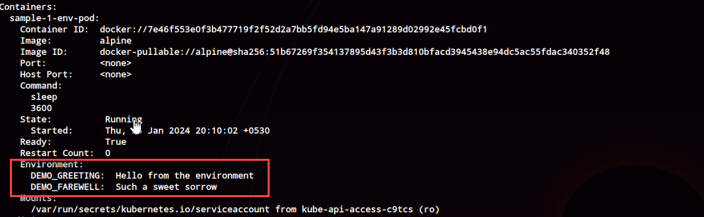

# Environment Variables

<!-- TOC -->
* [Environment Variables](#environment-variables)
  * [Setting via Docker](#setting-via-docker)
  * [K8s](#k8s)
    * [Sample 1:  Basics](#sample-1-basics)
    * [Sample 2: Replacement of environment variables in the definition](#sample-2-replacement-of-environment-variables-in-the-definition)
<!-- TOC -->

## Setting via Docker
```shell
# Set environment variables via docker
docker run -e key=val <image-name>
```

## K8s

### Sample 1:  Basics

```shell
k apply -f samples/environment/samples-1/env.yml
k get po sample-1-env-pod
k describe po sample-1-env-pod

# Shell in to check out environment variables
k exec -it sample-1-env-pod /bin/sh
# env | grep DEMO_GREETING
DEMO_GREETING=Hello from the environment
# env | grep DEMO_FAREWELL
DEMO_FAREWELL=Such a sweet sorrow
```



### Sample 2: Replacement of environment variables in the definition
```shell
k delete pods --all
k apply -f samples/environment/samples-2/env.yml
k logs -f sample-2-env-pod
```

