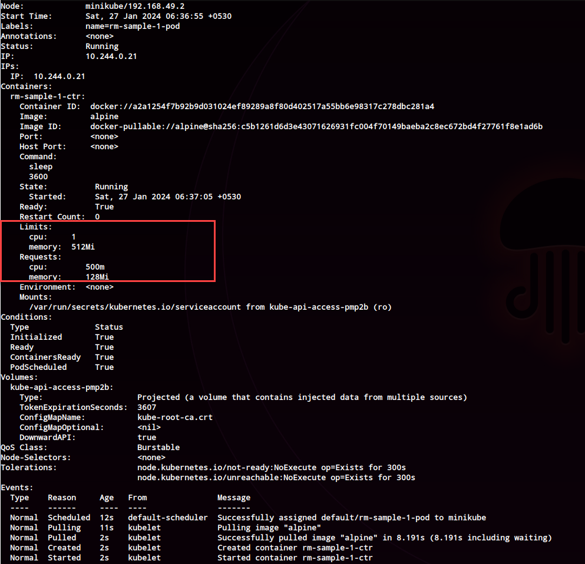

# Resource Management

There are 3 attributes as far as resource requirements for consideration

- Memory
- CPU
- Storage


* The placement of the pod in a node is based on the requirements specified in the pod if any.
* Scheduler will not place the pod on resources on nodes which do not fit the requirement.
* K8 will have the pod in "pending" state you will find a reason on why it is in pending state. It is also possible that the scheduler was unable to schedule the pod on a node as no nodes are available.
* K8 throttles CPU if it goes greater than the limit, containers can use more memory than the limit, but not CPU. Constant use of high memory will cause the pod to terminate. *
* CrashLoopBackOff usually, indicates that it is failing because the pod is out of memory

## Sample 1 - Using Request and Limits

```shell
k apply -f samples/rm.yml
k describe po rm-sample-1-pod
```
